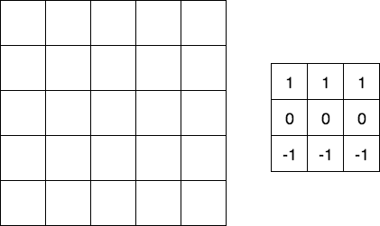
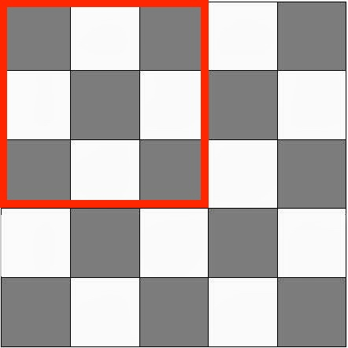
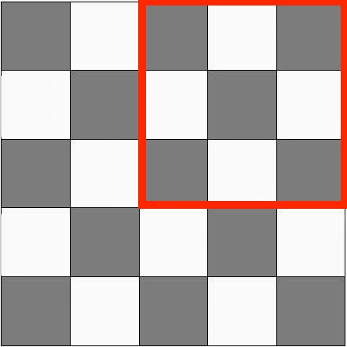
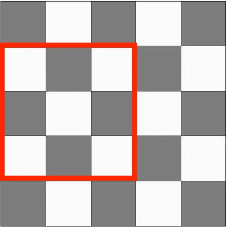

# Convolution Neural Networks

## Introduction   

Convolutional Neural Networks (CNNs), can deal better with large images. Until now, images that we have used were fairly small. Imagine an color image with 500 x 500 pixels, this means you would    end up having 500 x 500 x 3 = 750,000 input features, $(x_1,...,x_{750,000})$. Next, imagine having 2000 hidden units in the first hidden layer. Then the matrix $w^{[1]}$ would have dimensions (2000 x 750,000), and will have 1.5 billion parameters. So it becomes a very high-dimensional problem!

CNNs have certain features that identify patterns in images because of  "convolution operation" including:

- Dense layers learn global patterns in their input feature space

- Convolution layers learn local patterns, and this leads to the following interesting features:
    - Unlike with densely connected networks, when a convolutional neural network recognizes a patterns let's say, in the upper-right corner of a picture, it can recognize it anywhere else in a picture. 
    - Deeper convolutional neural networks can learn spatial hierarchies. A first layer will learn small local patterns, a second layer will learn larger patterns using features of the first layer patterns, etc. 
     
Because of these properties, CNNs are great for tasks like:
- Image classification
- Object detection in images
- Picture neural style transfer

## Objectives

* Describe what a CNN is
* Describe the basic architectural features of a CNN
* Identify common use cases for CNNs

## Building CNNs in Keras

Building a CNN in Keras is very similar to the previous neural networks that we have built to date. To start, you will initialize a sequential model as before and go on adding layers. However, rather then simply adding additional dense layers or dropouts between them, we will now start to investigate other potential layer architectures including convolutional layers.

## The Convolution Operation 

The idea behind the convolutional operation is to detect complex building blocks, or features, that can aid in the larger task such as image recognition. For example, we'll detect vertical or horizontal edges present in the image. Let's look at what horizontal edge detection would look like!

This is a simplified 5 x 5 pixel image (greyscale!). You use a so-called "filter" (denoted on the right) to perform a convolution operation. This particular filter operation will detect horizontal edges. The matrix in the left should have number in it (from 1-255, or let's assume we rescaled it to number 1-10). The output is a 3 x 3 matrix. (*This example is for computational clarity, no clear edges*)

In Keras, function for the convolution step is `Conv2D`.

The convolutional operation applies this filter (typically 3x3 or 5x5) to each possible 3x3 or 5x5 region of the original image. The graphic below demonstrates this process. Later, 

## Padding

There are some issues with using filters on images including: 

- The image shrinks with each convolution layer: you're throwing away information in each layer! For example:
    - Starting from a 5 x 5 matrix, and using a 3 x 3 matrix, you end up with a 3 x 3 image. 
    - Starting from a 10 x 10 matrix, and using a 3 x 3 matrix, you end up with a 8 x 8 image. 
    - etc.
- The pixels around the edges are used much less in the outputs due to the filter.  

For example, if we apply 3x3 filters to a 5x5 image, our original 5x5 image contains 25 pixels, but tiling our 3x3 filter only has 9 possible locations. Here's the 4 of the 9 possible locations for the 3x3 filter on a 5x5 image:  

Fortunately, padding solves both of these problems! Just one layer of pixels around the edges preserves the image size when having a 3 x 3 filter. We can also use bigger filters, but generally the dimensions are odd!

Some further terminology regarding padding that you should be aware of includes:

- "Valid" - no padding
- "Same" - padding such that output is same as the input size

By adding padding to our 5x5 image, (now a 6x6 image by adding a border of pixels) we can add padding so that each pixel of our original 5x5 image can be the center of a 3x3 convolution window filter.

## Strided convolutions

Another method to change the output of your convolutions is to change the stride. The stride is how the convolution filter is moved over the original image. In our above example, we moved the filter one pixel to the right starting from the upper left hand corner, and then began to do this again after moving the filter one pixel down. Alternatively, by changing the stride, we could move our filter by 2 pixels each time, resulting in a smaller number of possible locations for the filter.  

Strided convolutions are rarely used in practice but a good feature to be aware of for some models.

## Convolutions on RGB images

Instead of 5 x 5 grayscale, let's imagine a 7 x 7 RGB image, which boils down to having a 7 x 7 x 3 tensor. (The image itelf is compromised by a 7 by 7 matrix of pixels, each with 3 numerical values for the RGB values.) From there, you will need to use a filter that has the third dimension equal to 3 as well, let's say, 3 x 3 x 3 (a 3D "cube"). 

This allows us to detect, eg only horizontal edges in the blue channel (filter on the red and green channel all equal to 0). 

Then, in each layer, you can convolve with several 3D filters.
Then, you stack every output result together, and that way you end up having a 5 x 5 x (number of filters) shape.

If you think of it, the filter plays the same role as the w^{[1]} in our densely connected networks.

The advantage is, your image can be huge, the amount of parameters you have still only depends on how many filters you're using!

Imagine 20 (3 x 3 x 3) --> 20 * 27 + a bias for each filter (1* 20) = 560 parameters.

Notation:

- $f^{[l]}$ = size of the filter
- $p^{[l]}$ = padding
- $s^{[l]}$ = amount of stride
- $ n_c^{[l]}$ = number of filters
- filter: $f^{[l]}$ x $f^{[l]}$ x $ n_c^{[l-1]}$

- Input = $ n_h^{[l-1]} * n_w^{[l-1]} * n_c^{[l-1]} $
- Output = $ n_h^{[l]} * n_w^{[l]} * n_c^{[l]} $

Height and width are given by:

$n_h^{[l]}= \Bigr\lfloor\dfrac{n_h^{[l-1]}+2p^{[l]}-f^{[l]}}{s^{[l]}}+1\Bigr\rfloor$

$n_w^{[l]}= \Bigr\lfloor\dfrac{n_w^{[l-1]}+2p^{[l]}-f^{[l]}}{s^{[l]}}+1\Bigr\rfloor$

Activations: $a^{[l]}$ is of dimension $ n_h^{[l]} * n_w^{[l]} * n_c^{[l]} $

## Pooling layer

    The last element in a CNN architecture (before fully connected layers as we have previously discussed in other neural networks) is the pooling layer. This layer is meant to substantially downsample the previous convolutional layers. The idea behind this is that the previous convolutional layers will find patterns such as edges or other basic shapes present in the pictures. From there, pooling layers such as Max pooling (the most common) will take a summary of the convolutions from a larger section. In practice Max pooling (taking the max of all convolutions from a larger area of the original image) works better then average pooling as we are typically looking to detect whether a feature is present in that region. Downsampling is essential in order to produce viable execution times in the model training.

Max pooling has some important hyperparameters:
- f (filter size)
- S (stride)

Common hyperparameters include: f=2, s=2 and f=3, s=2, this shrinks the size of the representations.
If a feature is detected anywhere in the quadrants, a high number will appear. so max pooling preserves this feature.

## Fully Connected Layers in Your CNN.

Once you have addded a number of convolutional layers and pooling layers, yoiu then. will add fully connected (dense) layers as we did before in previous neural network models. This now allows the network to learn a final decision function based on these transformed informative inputs generating from the convolutional and pooling layers.

## Additional Resources

* https://blog.keras.io/how-convolutional-neural-networks-see-the-world.html
* https://datascience.stackexchange.com/questions/16463/what-is-are-the-default-filters-used-by-keras-convolution2d
* https://stanford.edu/~shervine/teaching/cs-230/cheatsheet-convolutional-neural-networks
* https://www.coursera.org/learn/convolutional-neural-networks/lecture/A9lXL/simple-convolutional-network-example
* https://www.coursera.org/learn/convolutional-neural-networks/lecture/uRYL1/cnn-example

## Summary   

In this lesson, we discussed the basic concepts behind CNNs including their use cases and general archictecture. In the upcoming lab, we'll begin to look at how you can build these models in Python using Keras.
